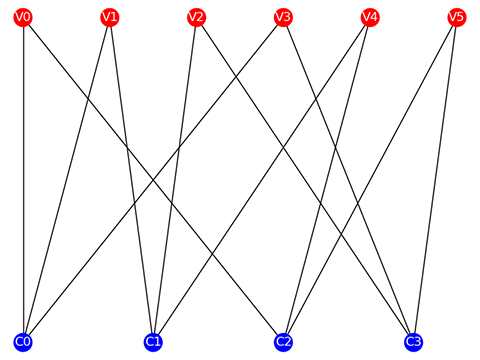

# LPDC-with-SIMD

LPDC with SIMD aimed at AMD CPUs.

## Environment

- OS: Ubuntu 20.04.1
- CPU: AMD 3700X
- Dependency: [Eigen3](http://eigen.tuxfamily.org)

### Install Eigen

```Bash
git clone https://gitlab.com/libeigen/eigen.git
cd eigen
mkdir build
cd build
cmake ..
cmake -DEIGEN_TEST_AVX=ON -DEIGEN_TEST_AVX2=ON .
sudo make install
```

## How to use

### 1 Simulation

```Bash
mkdir build
cd build
cmake ..
make
../bin/LDPC-with-SIMD --dec-h-path ../example/H.alist
```

### 2 Tools

#### 2-1 Draw Tanner

```Bash
python3 script/tanner.py --dec-h-path example/H.alist
```



#### 2-1 Type in Alist

```Bash
python3 script/makeAlist.py
# nRow is: 4
# nCol is: 6
# 1 1 0 1 0 0 
# 0 1 1 0 1 0
# 1 0 0 0 1 1
# 0 0 1 1 0 1
# filename is: aaa.alist
```

## References

### Binary LDPC and Basic

- [pyldpc](https://github.com/hichamjanati/pyldpc.git)
- [5G-SIMD-LDPC](https://github.com/SherlockHsu/5G-SIMD-LDPC)
- [Python处理alist文件](https://www.cnblogs.com/lingr7/p/13038410.html)
- [aff3ct](https://github.com/aff3ct/aff3ct)

### Nonbinary LDPC

- [NB_LDPC_FB](https://github.com/cedricomarchando/NB_LDPC_FB)

### C++ tutorial

- [c++模板类(一)理解编译器的编译模板过程](http://blog.csdn.net/onafioo/article/details/29857281)